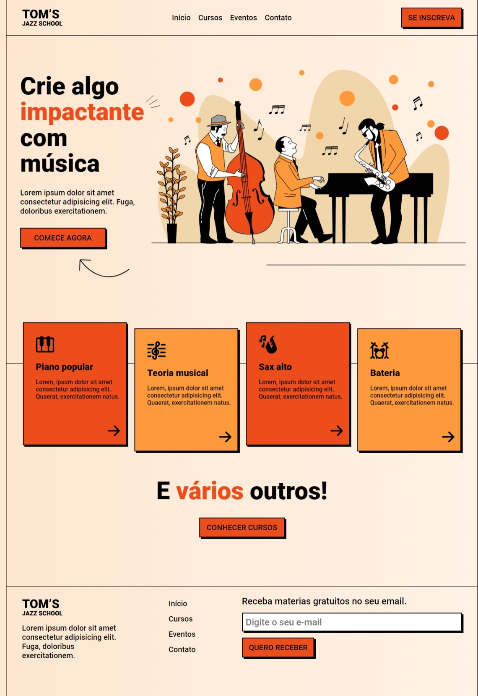
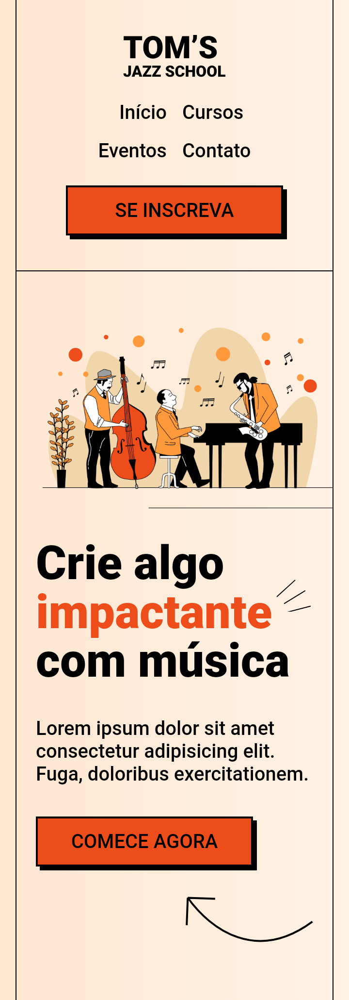
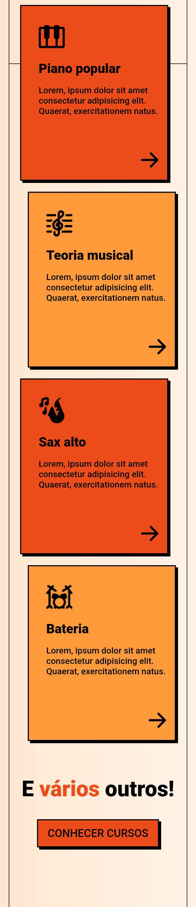
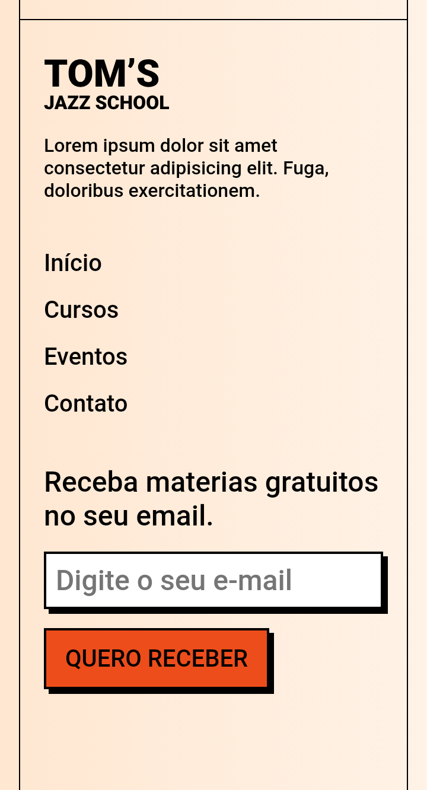

# Projeto-Landing-Page-da-OneBitCode


## Tabela de conteúdos

- [Visão Geral](#visao-geral)
  - [Sobre o projeto](#sobre-o-projeto)
  - [Screenshot](#screenshot)
  - [Links](#links)
- [Meu processo](#meu-processo)
  - [Construído com](#construido-com)
  - [O que eu aprendi](#o-que-eu-aprendi)
  - [Desenvolvimento contínuo](#desenvolvimento-continuo)
- [Autora](#autora)
- [Agradecimentos](#agradecimentos)


## Visão Geral

### Sobre o projeto

Neste projeto, realizado pelo professor Issac Pontes, fizemos uma bela landing page responsiva sobre uma escola de jazz fictícia.
Foi aplicado o conceito de "mobile first" onde se desenvolve primeiro o site para dispositivos móveis e depois adapta para dispositivos maiores.


### Screenshot

#### Para Desktop:


#### Para Mobile:





### Links

- URL do site: [https://beatrizvsgoncalves.github.io/project-landing-page/](https://beatrizvsgoncalves.github.io/project-landing-page/)


## Meu processo


### Construído com

- HTML5 semântica
- CSS Grid
- Flexbox
- Mobile-first workflow
- Figma


### O que eu aprendi

Eu aprendi diversas coisas, mas o que mais me marcou foi o menu responsivo, as margens negativas, usar **rem** e **em** como medidas (inclusive agora já estou usando isso no dia a dia) e como usar decorações pontuais que embelezem o site.

```css
.decoration::after {
  content: '';
  background: url("images/three-dashes.svg");
  position: absolute;
  top: -0.75rem;
  height: 36px;
  width: 40px;
}
```


### Desenvolvimento contínuo

Foi uma experiência muito gratificante onde me deu mais motivação para continuar meus estudos na área de desenvolvimento web. E já consegui implementar diversas coisas que fizemos neste projeto em outros.


## Autora

- Github - [beatrizvsgoncalves](https://github.com/beatrizvsgoncalves)
- LinkedIn - [beatriz-vs-goncalves](https://www.linkedin.com/in/beatriz-vs-goncalves/)
- Frontend Mentor - [@beatrizvsgoncalves](https://www.frontendmentor.io/profile/beatrizvsgoncalves)


## Agradecimentos

Meus agradecimentos ao professor Issac Pontes e a OneBitCode por essas duas aulas maravilhosas onde eu pude aprender demais. 🤘